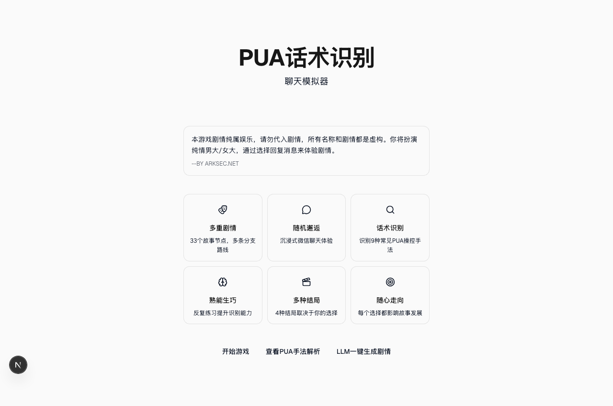
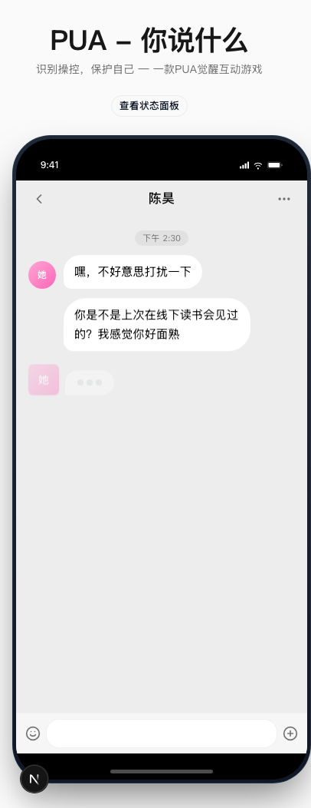
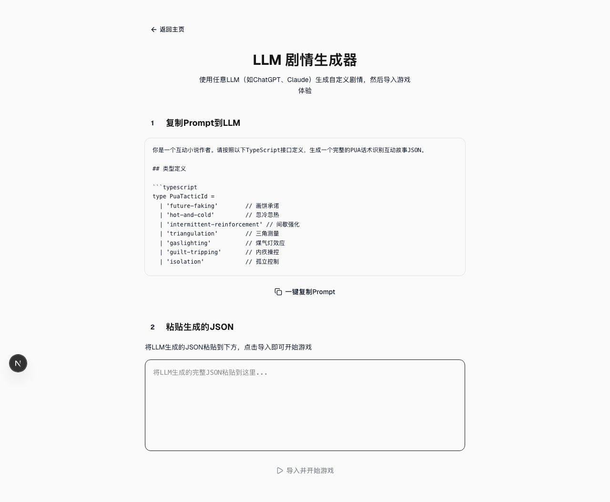

<p align="center">
  
</p>

# PUA话术识别 — 聊天模拟器

An interactive WeChat-style chat simulator that teaches you to recognize 9 common PUA (Pick-Up Artist) manipulation tactics through immersive storytelling.



## Screenshots

| Home | Play | Analysis | Generator |
|------|------|----------|-----------|
|  |  |  |  |

## Features

- **33 story nodes** with multiple branching paths and 4 distinct endings
- **WeChat-style chat UI** with typing indicators, avatars, and phone mockup
- **9 PUA tactics** identified in real-time as you play (gaslighting, future faking, triangulation, etc.)
- **4-stat system** tracking affection, alertness, money, and social circle
- **LLM story generator** — paste a prompt into ChatGPT/Claude to create custom scenarios
- **Analysis page** breaking down each tactic with examples and counter-strategies

## Tech Stack

- Next.js 16 + React 19
- Tailwind CSS 4 + shadcn/ui
- TypeScript
- Threads-inspired minimal design (black/white, thin borders, Lucide icons)

## Getting Started

```bash
git clone https://github.com/Sma1lboy/pua-what-game.git
cd pua-what-game
npm install
npm run dev
```

Open [http://localhost:3000](http://localhost:3000).

## How It Was Built

This project was scaffolded and iteratively redesigned using the [autonomous-skill](https://github.com/anthropics/claude-code) workflow for Claude Code. The entire UI redesign (shadcn/ui integration, Threads aesthetic, all 4 page redesigns) was completed autonomously across 4 sprints by an AI conductor dispatching sprint masters and workers, with zero manual code edits.

## License

MIT
